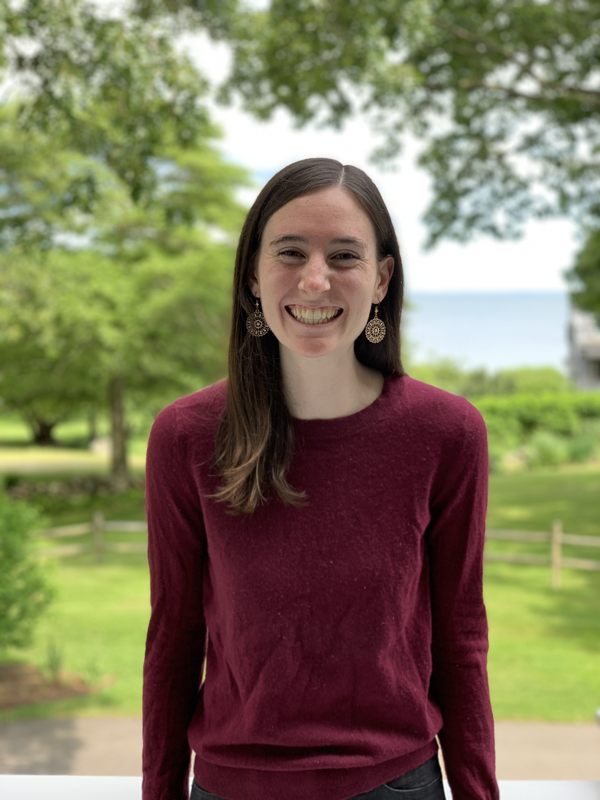

MPH Candidate,
Columbia University Mailman School of Public Health

## About Me

I'm a current MPH student at Columbia Mailman University School of Public Health. I received a BA in biochemistry and sociology from Bowdoin College in 2017. 

My research interests include the impact of Medicaid policy changes on maternal health outcomes and the barriers faced by reproductive-age and pregant women in gaining access to health services.

My past research has focused on global respectful maternity care and utilizing mathematical models and quantitative analyses to understand the health of people living with HIV, people who inject drugs, and formerly-incarcerated populations in the United States. 

I am a former sprinter turned marathon runner, cyclist, hiker, and lover of fancy doughnuts.

 

## Contact Information

* Email: meb2308@cumc.columbia.edu
* LinkedIn: https://www.linkedin.com/in/meghan-bellerose/
